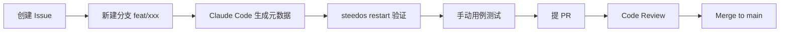

# 开发者指南

## 1. 环境准备

| 工具 | 版本 | 说明 |
|---|---|---|
| Node.js | ≥ 18 LTS | Steedos 要求 |
| pnpm | ≥ 8 | 包管理 |
| Docker / Compose | latest | 起 MongoDB/Redis |
| Git | ≥ 2.40 | — |
| MongoDB | 6+ | 可用 docker |
| Redis | 7+ | 可用 docker |

## 2. 首次启动

```bash
git clone <repo>
cd crm
cp .env.example .env
docker compose up -d mongo redis
pnpm install
pnpm start          # 等同 steedos start
```

启动成功后访问 `http://localhost:5000`，默认 admin 账号见 `.env` 中的 `STEEDOS_INITIAL_*`。

## 3. 常用命令

| 命令 | 用途 |
|---|---|
| `pnpm start` | 开发模式启动（监听 metadata 变化） |
| `pnpm restart` | 触发元数据重载 |
| `pnpm steedos source push` | 推送本地元数据到运行实例 |
| `pnpm test` | 运行单测（按需） |
| `pnpm lint` | YAML / JS lint |

## 4. 开发流程



## 5. 调试

- 日志：`logs/` 目录或 stdout。
- 元数据语法错误：启动时会打印对象路径与行号。
- ObjectQL 调试：`/api/v6/data/<object>/records?fields=...&filters=...`
- 触发器调试：在 `.trigger.yml` handler 中加 `console.log`，restart 后重放。

## 6. 目录约定

请严格遵循 [coding-standards/directory.md](../coding-standards/directory.md)。

## 7. 提交流程

请遵循 [coding-standards/commit-pr.md](../coding-standards/commit-pr.md)。

## 8. 常见问题

| 问题 | 处理 |
|---|---|
| 启动报 `Cannot connect to mongo` | 检查 `MONGO_URL` 与 docker 是否运行 |
| 元数据不生效 | 确认文件名后缀（`.object.yml` 等）与目录是否正确 |
| 字段类型错 | 参照 Steedos `object-fields` skill |

## 变更记录

| 版本 | 日期 | 变更 | 作者 |
|---|---|---|---|
| 0.1.0 | 2026-04-27 | 初稿 | AI |
