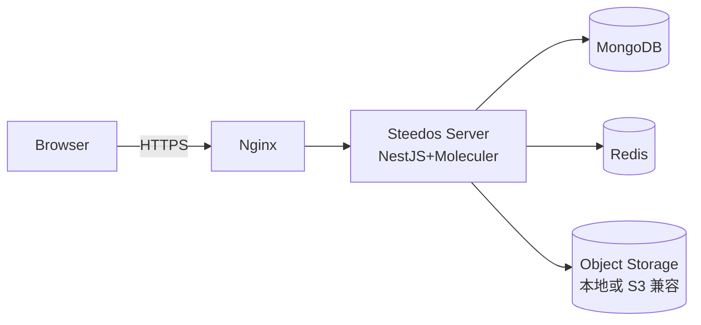
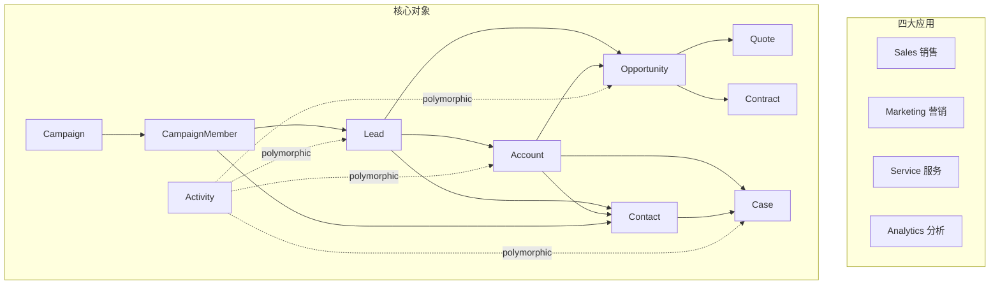

# 总体架构

## 1. 设计原则

1. **元数据驱动**：业务对象、字段、视图、权限均以 YAML 元数据声明，避免硬编码。
2. **AI 友好**：目录结构、命名规则、产物粒度统一，便于 Claude Code 增量生成与回归。
3. **平台优先**：复用 Steedos 内建能力（鉴权、对象服务、Amis 渲染、ObjectQL），不自建。
4. **可回退**：每个迭代独立 commit；失败时可单 PR 回滚。
5. **私有部署**：依赖均可本地运行（MongoDB、Redis），无 SaaS 强绑定。

## 2. 技术栈

| 层 | 技术 | 说明 |
|---|---|---|
| 运行时 | Node.js ≥ 18 | Steedos Server 要求 |
| 框架 | NestJS 11 + Moleculer 0.14 | Steedos 内嵌 |
| 数据库 | MongoDB 6+ | 主存储 |
| 缓存/消息 | Redis 7+ | session / pub-sub |
| 前端 | Amis (低代码) + Steedos Unpkg | 内建，不二开 |
| 分析 | @steedos-labs/analytics | dashboard / question |
| 包管理 | pnpm | monorepo 友好 |
| 容器 | docker-compose | 部署 |
| CI | GitHub Actions | lint / test / build |

## 3. 部署拓扑



- 单节点 docker-compose 即可运行 MVP。
- 生产建议：Steedos Server 多实例 + Mongo 副本集 + Redis 主从。

## 4. 应用结构



## 5. 包结构

```
crm/
├── package.json
├── steedos-config.yml
├── docker-compose.yml
├── .env.example
├── docs/
└── steedos-packages/
    └── crm/
        └── main/default/
            ├── objects/{leads,accounts,...}/
            ├── triggers/
            ├── functions/
            ├── applications/{sales,marketing,service,analytics}.app.yml
            ├── tabs/
            ├── pages/
            ├── permissionsets/
            ├── dashboards/
            ├── questions/
            ├── data/
            └── translations/
```

## 6. 关键决策

详见 ADR：

- [ADR-0001 选择 Steedos 作为底座](../project-management/adr/0001-platform-steedos.md)
- [ADR-0002 元数据先行的开发顺序](../project-management/adr/0002-metadata-first.md)
- [ADR-0003 AI 全程参与的协作模式](../project-management/adr/0003-ai-driven-development.md)

## 7. 非功能需求

| 维度 | 目标 |
|---|---|
| 性能 | 单实例 200 并发，列表页 P95 < 1s |
| 可用性 | 单节点 99%；生产部署多实例 99.9% |
| 安全 | RBAC + 字段级权限；HTTPS；密码 bcrypt |
| 可观测 | Steedos 内建日志 + Prometheus exporter（W6+） |
| 可维护 | 元数据 100% YAML；trigger/function 单一职责 |

## 变更记录

| 版本 | 日期 | 变更 | 作者 |
|---|---|---|---|
| 0.1.0 | 2026-04-27 | 初稿 | AI |
