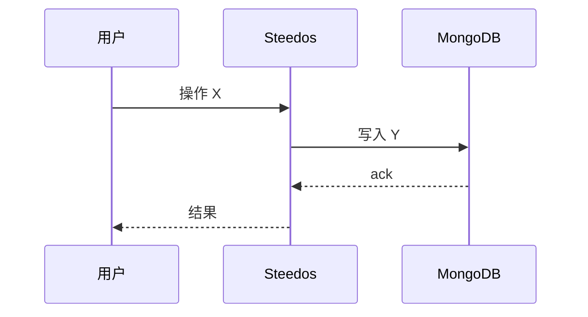

# <FLOW-NNN> <流程名>

## 1. 目的

<一段话描述价值>

## 2. 触发方式

- 触发者：<销售员/系统/定时任务>
- 触发条件：<点击按钮/字段变更/cron>

## 3. 流程图

## 4. 步骤

| # | 执行者 | 动作 | 系统反应 |
|---|---|---|---|
| 1 |  |  |  |
| 2 |  |  |  |

## 5. 数据变更

| 对象 | 字段 | 变化 |
|---|---|---|
|  |  |  |

## 6. 异常与回退

| 场景 | 处理 |
|---|---|
|  |  |

## 7. 验收用例

| 用例 ID | 前置 | 操作 | 预期 |
|---|---|---|---|
| AC-NNN-01 |  |  |  |

## 8. 关联

- 对象：
- 触发器：
- 函数：
- UI：

## 变更记录

| 版本 | 日期 | 变更 | 作者 |
|---|---|---|---|
| 0.1.0 | YYYY-MM-DD | 初稿 | AI |
