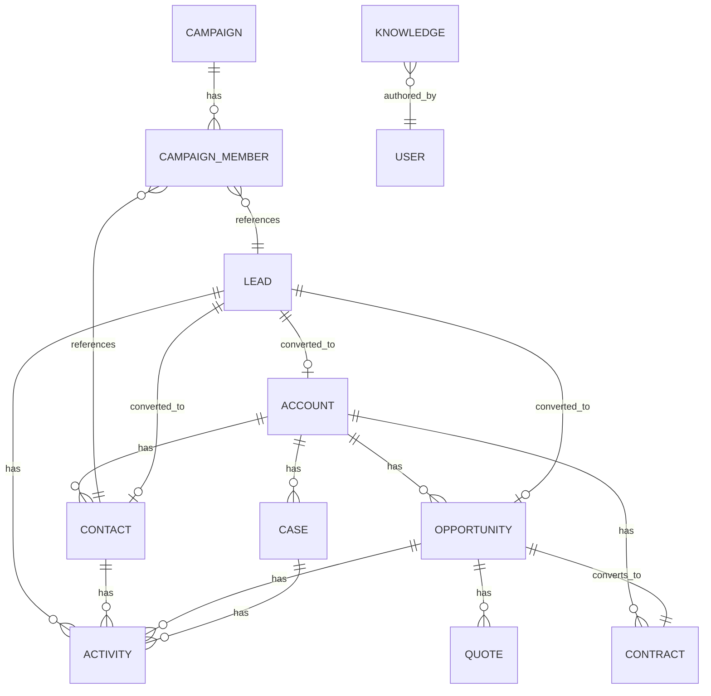

# 数据模型总览

## 1. 实体关系图

## 2. 对象清单

| API Name | Label | 模块 | is_name 字段 | 关键关系 |
|---|---|---|---|---|
| `crm_leads` | 线索 | sales | `lead_number` (autonumber) | converted_account/contact/opportunity |
| `crm_accounts` | 客户 | sales | `name` | parent_account（自关联） |
| `crm_contacts` | 联系人 | sales | `contact_number` | account |
| `crm_opportunities` | 商机 | sales | `opp_number` | account, contact |
| `crm_quotes` | 报价单 | sales | `quote_number` | opportunity |
| `crm_contracts` | 合同 | sales | `contract_number` | account, opportunity |
| `crm_campaigns` | 营销活动 | marketing | `name` | parent_campaign |
| `crm_campaign_members` | 活动成员 | marketing | autonumber | campaign, lead/contact（互斥） |
| `crm_email_templates` | 邮件模板 | marketing | `name` | — |
| `crm_cases` | 工单 | service | `case_number` | account, contact |
| `crm_knowledge` | 知识库 | service | `title` | author |
| `crm_activities` | 活动记录 | 公共 | `subject` | related_to（多态） |

## 3. 命名规范

- API name：`crm_` 前缀 + 复数小写下划线（`crm_opportunities`, `crm_campaign_members`）。详见 [ADR-0004](../project-management/adr/0004-object-naming-prefix.md)。
- Label：中文（"商机", "活动成员"）。
- 字段：snake_case；外键以对象短名（去前缀）单数命名（`account`, `contact`）。
- autonumber 字段：以 `_number` 结尾；显示格式 `{prefix}-{####}`，如 `LEAD-0001`。

## 4. 公共字段

每个对象自动具备 Steedos 平台字段（无需声明）：`_id`, `created`, `created_by`, `modified`, `modified_by`, `owner`, `space`, `company_id`, `locked`。

## 5. 详细字段定义

各对象详细字段表请见同目录下的 `<object>.md`，例如：

- [leads.md](./leads.md)
- [accounts.md](./accounts.md)
- [opportunities.md](./opportunities.md)
- ...

## 6. 数据完整性约定

- 删除策略：默认软删除（Steedos 平台支持），客户/商机不允许物理删除。
- 必填项：`leads.last_name`, `leads.company`, `accounts.name`, `opportunities.account`, `opportunities.stage`, `opportunities.close_date`, `cases.subject`, `cases.priority`。
- 唯一性：邮箱在 leads / contacts 内唯一（W2 后增加约束）。

## 变更记录

| 版本 | 日期 | 变更 | 作者 |
|---|---|---|---|
| 0.1.0 | 2026-04-27 | 初稿 | AI |
